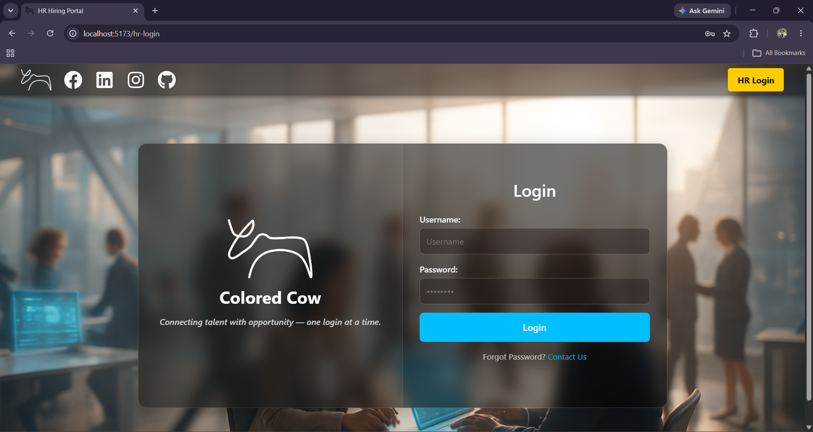
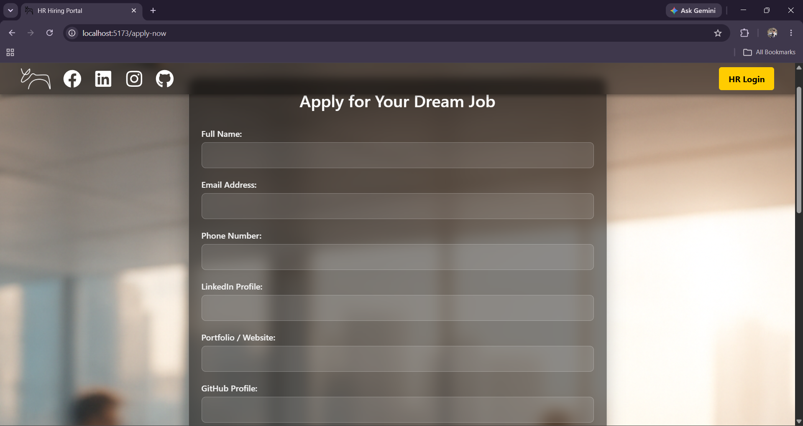
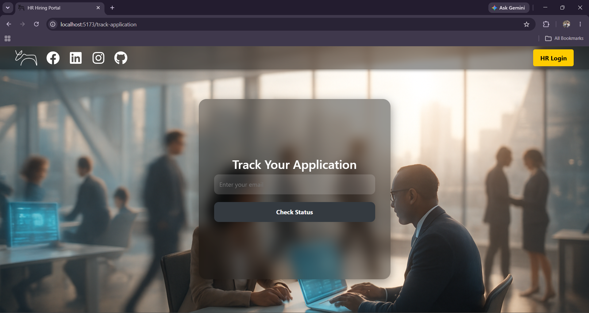
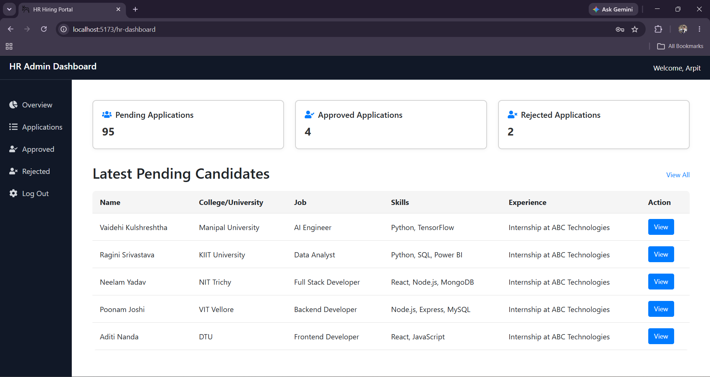
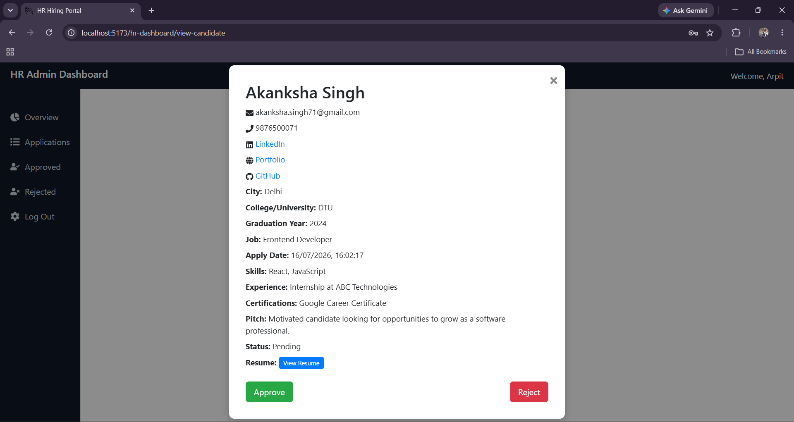
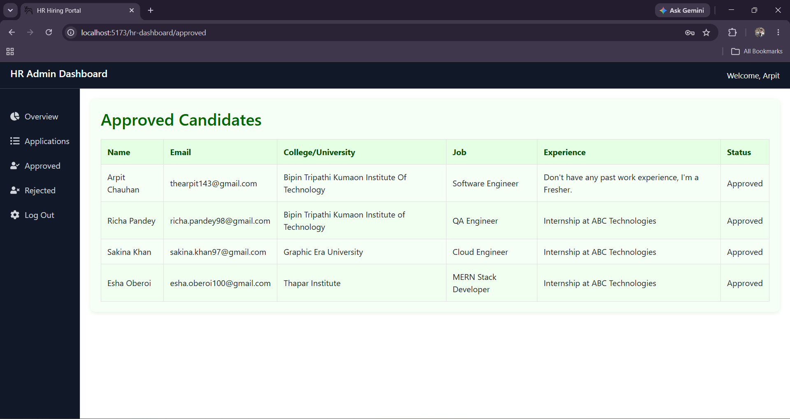
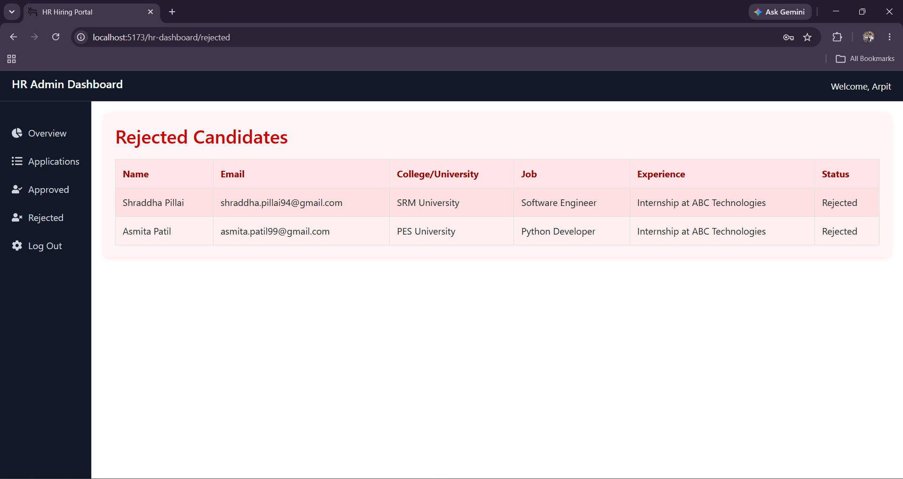

# Job Application Management System

A full-stack Job Application Management System that simplifies the hiring process by providing separate portals for **Candidates** and **HR**. Candidates can apply for jobs, upload resumes, and track their applications, while HR can review applications and approve or reject candidates.

---

## Features

### Candidate Portal

- Apply for jobs through an online application form
- Upload resume (PDF)
- Add GitHub, LinkedIn and portfolio links
- Track application status
- View application details

### HR Portal

- Secure HR login using JWT authentication
- View all job applications
- View complete candidate profiles
- Approve or reject applications
- Dashboard for managing candidates

### General Features

- Role-based functionality
- Resume upload and storage
- REST API architecture
- Responsive user interface
- MySQL database integration

---

## Tech Stack

### Frontend

- React (Vite)
- React Router
- Redux Toolkit
- Axios
- Bootstrap
- React Toastify
- React Icons

### Backend

- Node.js
- Express.js
- JWT Authentication
- Multer
- MySQL

---

## Project Structure

```
job-application-management-system
│
├── hr-backend/
├── hr-frontend/
├── screenshots
└── README.md
```

---

## Installation

### 1. Clone the repository

```bash
git clone https://github.com/thearpit143/job-application-management-system.git
cd job-application-management-system
```

---

### 2. Backend Setup

```bash
cd hr-backend
npm install
```

Create a `.env` file inside **hr-backend**.

Example:

```env
MYSQL_HOST=localhost
MYSQL_USER=your_mysql_username
MYSQL_PASSWORD=your_mysql_password
MYSQL_DATABASE=hiring_portal
MYSQL_PORT=3306

JWT_SECRET=your_secret_key
```

Start the backend server:

```bash
npm start
```

---

### 3. Frontend Setup

```bash
cd hr-frontend
npm install
npm run dev
```

---

## Database Setup

1. Install MySQL.
2. Create a database named:

```sql
hiring_portal
```

3. Import the provided `schema.sql` file.

4. Update your `.env` file with your MySQL credentials.

---

## API Authentication

The HR dashboard uses JWT authentication. Configure your own secret key inside the `.env` file before running the backend.

---

## Screenshots

### Home Page


---

### HR Login



---

### Apply for Job



---

### Track Application



---

### HR Dashboard



---

### Candidate Profile



---

### Approved Candidates



---

### Rejected Candidates



---

## Future Improvements

- Email notifications
- Search and filtering
- Pagination
- Multiple HR roles
- Interview scheduling
- Docker support
- Deployment using Render/Vercel
- CI/CD pipeline

---

## Contributing

Contributions are welcome. Feel free to fork the repository and submit a pull request.

---

## Author

**Arpit Chauhan**

B.Tech Computer Science & Engineering

GitHub: https://github.com/thearpit143


---

## Support

If you found this project helpful, consider giving it a ⭐ on GitHub.